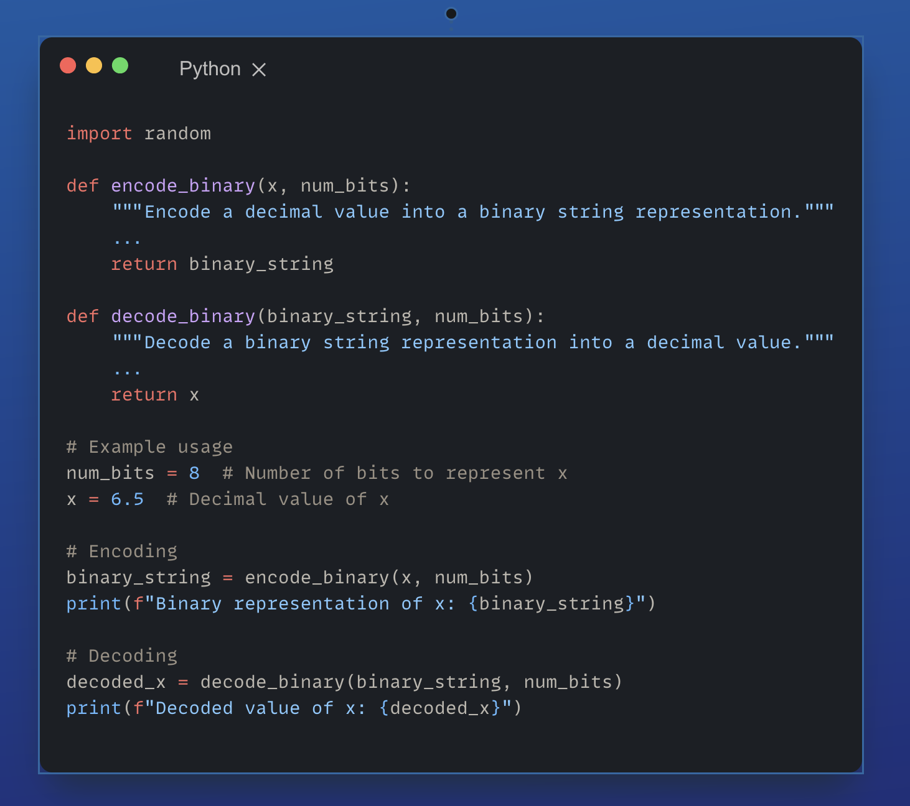

# **Zadanie**

Zaimplementuj w Pythonie funkcje kodowania i dekodowania binarnego dla następującego problemu. Załóżmy, że chcemy zmaksymalizować funkcję f(x) = x^2 w zakresie [0, 10]. Będziemy reprezentować rozwiązania jako stringi binarne, gdzie każdy bit odpowiada zmiennej x.

<p align="center">
  
</p>

**Wynik programu:**

``` python
Reprezentacja binarna x: 10100110
Zdekodowana wartość x: 6.484375
```
