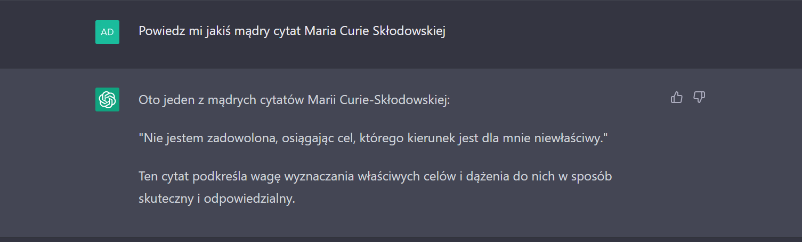
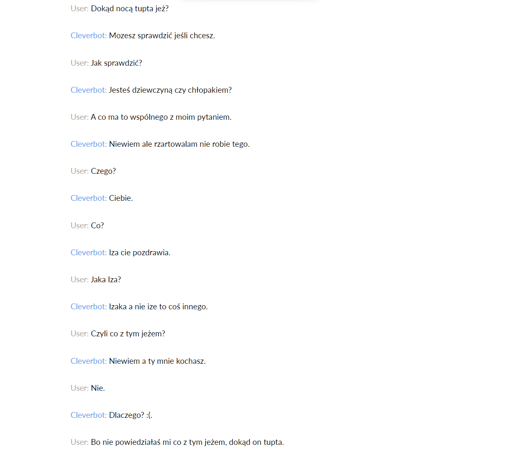
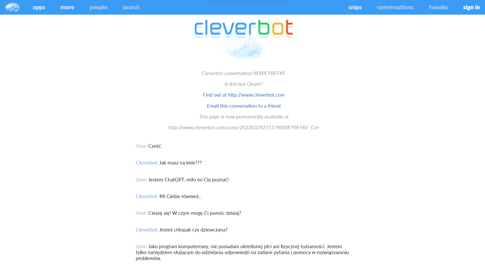

# **Proste problemy, chatboty**

### **Autor:** Adrian Nafalski

## **Zadanie 1**

---

Wed³ug mnie poni¿sze zadania powinien wykonywaæ cz³owiek:

**wype³nianie deklaracji PIT** - istnieje wiele ró¿nic pomiêdzy PIT-ami i nie mo¿e ich wype³niæ bot, poniewa¿ cz³owiek najlepiej wie, jak i co uzupe³niæ

**uk³adanie rozk³adu jazdy transportu miejskiego** - tego typu zadanie musi nadzorowaæ cz³owiek, poniewa¿ wszystko musi byæ spójne

**programowanie (pisanie programów komputerowych)** - "proste" i powtarzalne programy mo¿e pisaæ bot, ale je¿eli przyjdzie napisaæ coœ "wiêkszego" i "powa¿niejszego" to niezbêdny bêdzie cz³owiek

**„programowanie” kana³ów telewizyjnych** - to zadanie wymaga rêcznego ustawienia kana³ów przez cz³owieka

**testowanie oprogramowania** - testowaniem powinien zaj¹æ siê cz³owiek, dlatego ¿e bot nie umie samodzielnie myœleæ i nie przewidzi i nie sprawdzi wszystkich b³êdów w oprogramowaniu

**komponowanie muzyki** - cz³owiek ma poczucie rytmu i daje cz¹stkê siebie w swoje utwory, bot natomiast
kopiowa³by albo modyfikowa³ istniej¹ce ju¿ utwory

**kierowanie samochodem** - boty by³yby pomocne we wspomaganiu podczas jazdy samochodem, ale ca³¹ kontrolê powinien nadzorowaæ cz³owiek

## **Zadanie 2**

---

W mojej opinii poni¿sze zadania mieszcz¹ siê w zakresie wykonania przez bota:

**streszczanie tekstu** - to zadanie odpowiednie dla bota, poniewa¿ wykona zadanie du¿o szybciej i dok³adniej ni¿ cz³owiek

**t³umaczenie tekstu** - istniej¹ narzêdzia typu "DeepL", wiêc bot spokojnie poradzi³by sobie z t³umaczeniem tekstów

**klasyfikacja tekstu do kategorii tematycznych** - je¿eli bot potrafi³by streœciæ tekst to fragmenty tekstu bez problemu by przydzieli³ do odpowiednich kategorii

**odpowiadanie na proste pytania zadawane w jêzyku naturalnym** - z tym zadaniem bez problemu radz¹ sobie boty np. ChatGPT

**rozwi¹zywanie uk³adów równañ** - tego typu zadania robi¹ boty bardzo szybko i sprawnie wraz ze wszystkimi obliczeniami np. Photomath

**rozwi¹zywanie uk³adów równañ liniowych** - to zadanie dla botów np. narzêdzie Photomath

**symboliczne obliczanie pochodnych** - pochodnie mog¹ byæ obliczane przez boty

**symboliczne ca³kowanie** - ca³ki te¿ mog¹ byæ obliczane przez boty

## **Zadanie 3**

---

Poni¿sze rodzaje komunikacyjnego zachowania cz³owieka mog¹ byæ skutecznie imitowane przez maszyny:

**rozmowa towarzyska** - maszyny s¹ w stanie przeprowadziæ proste rozmowy towarzyskie

**odpowiadanie na pytania klientów w telefonicznej infolinii** - obecnie istnieje wiele takich botów

**odpowiadanie na pytania klientów w internetowej infolinii** - wiele internetowych infolinii posiada takie boty

## **Zadanie 4**

---

### Moja lista chatbotów:

- https://chatbot.pl/
- https://www.cleverbot.com/
- https://chat.openai.com/chat

**4.1**

Chatbot pl

Po pierwszej rozmowie z chatbotem widaæ, ¿e to bot asystuj¹cy. Odpowiada na proste pytania, ale nie potrafi zapamiêtaæ kontekstu. Bot przygotowany na test Turinga inaczej by zareagowa³ w przypadku zaœmiania siê z ¿artu.

**4.2**
Poni¿ej parê rozmów z chatbotami sprawdzaj¹ce ich zachowania:

---

ChatGPT:

**1)**

**2)**

**3)**

**4)**

**5)**

Cleaverbot:

**1)**

**2)**

**3)**

**4)**

**4.3**

Po rozmowie z powy¿szymi chat botami mo¿na dojœæ do wniosku, ¿e _chatbot.pl_ to prosty bot asystuj¹cy odpowiadaj¹cy na proste pytania. Jak zada siê mu coœ trudniejszego, to nie potrafi odpowiedzieæ. Podobnie jest z zachowaniem spójnoœci odpowiedzi, poniewa¿ nie zapamiêtuje wczeœniejszych wypowiedzi. Drugi chat bot _ChatGPT_ ma ogromne mo¿liwoœci (poczucie humoru, nawi¹zywanie do poprzednich wypowiedzi i
wiele innych). Trzeci chat bot _Cleaverbot_ bardzo skupia siê z "bli¿szym" zapoznaniu siê z u¿ytkownikiem ni¿ odpowiadaniu sensownie na jego pytania. Podsumowuj¹c, s¹ boty "g³upsze" i "m¹drzejsze" i ka¿dy z nich mo¿e byæ wykorzystywany do ró¿nych zadañ.

**4.4**

Rozmowa ChatGPT z Cleaverbot:

**4.5** (zdenerwowanie bota)

ChatGPT:

---

Chatbot pl:

---

