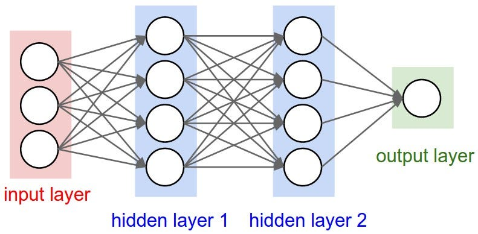

# **Zadanie**

Wykorzystując kod klasy Neuron zaimplementuj sieć neuronową z poniższą strukturą oraz dostarcz kod do wizualizacji struktury sieci. 

  

##### **Notka:**

Zauważ, że ponieważ sieć ma jeden neuron wyjściowy jest wyjście sieci będzie prawdopodobnie klasyfikacją binarną.
